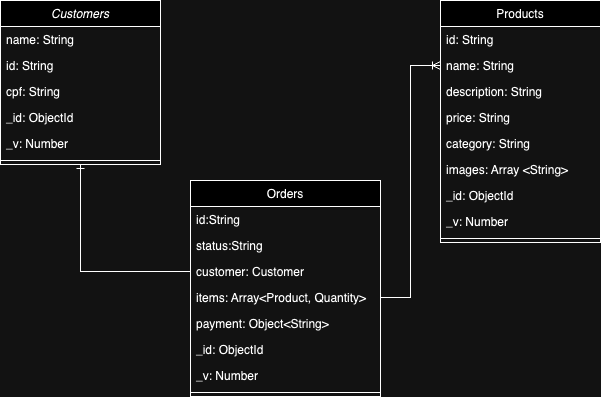

# Tech Challenger Pos Tech SOAT - Fase 3
### Repositórtio: DB

Link do vídeo detalhando Infra pode ser visto <a href="https://www.youtube.com/watch?v=NSo-g591sfc" target="_blank">aqui</a>  
Link do vídeo detalhando Lambda pode ser visto <a href="https://www.youtube.com/watch?v=bhSfoafsJRI" target="_blank">aqui</a>  
Link do vídeo detalhando DB pode ser visto <a href="https://youtu.be/zwMHTSwiaRA" target="_blank">aqui</a>  

### Outros repositórios da fase:
<b>App Node com CI/CD:</b> https://github.com/posttech-grupo60/postech-fiap 
<b> Infra com Terraform | Kubernetes | AWS (EKS): </b> https://github.com/grunbruno/postech-tf-k8s  
<b>Lambda:</b> [https://github.com/posttech-grupo60/postech-fiap](https://github.com/posttech-grupo60/postech-fiap-tf-lambda)  

# Modelagem do banco de dados

## Entidades

### Customers

A entidade Customers tem como função armazenar as informações de clientes que realizam pedidos no sistema, seus atributos são:

- name: Nome do usuário
- cpf: CPF único do usuário
- id: Identificador único do usuário
- \_id: Identificador único objeto no banco de dados
- \_v: Número de versão do objeto

### Products

A entidade Products tem como função armazenar as informações dos produtos, sendo seus atributos:

- id: Identificador único
- name: Nome do produto
- description: Descrição das características do produto
- price: Preço unitário do produto
- category: Segregação de categorias que o produto se encaixa
- images: Agrupamento de url's de imagens do produto
- \_id: Identificador único objeto no banco de dados
- \_v: Número de versão do objeto

### Orders

A entidade Orders se caracteriza por armazenar os pedidos dos usuários, tendo relacionamento com as entidades Customers para identificar o usuário do pedido, e Products para obter quais produtos o usuário solicitou, os relacionamentos se dão através do enriquemento dos dados nessa collection utilizando os campos customer e dentro do objeto Item. Assim tendo seus atributos:

- id: Identificador único do pedido
- status: Status ao qual o pedido se encontra no momento
- customer: Objeto com informações do usuários ao qual realizou o pedido
- items: Lista de produtos e suas quantidades aos quais o usuários solicitou
- payment: Objeto com informações de pagamento
- \_id: Identificador único objeto no banco de dados
- \_v: Número de versão do objeto

## Razões da escolha

- Agilidade no desenvolvimento: Por nosso sistema utilizar Javascript, a visualização e desenvolvimento utilizando JSON com padrão de documento do banco gerou facilidade.
- Esquema flexível: Por se tratar de um MVP muitas coisas podem mudar, não ter que desenvolver um novo esquema em casos alterações nas regras traz mais agilidade.
- Escalabilidade horizontal: Caso haja necessidade de expansão do sistema podemos escalar de forma fácil utilizando MongoDB.
- Sistema de Réplicas: O MongoDB possibilita a utilização do sistema de replicas com facilidade, assim evitando a perda de dados.

### Integrantes Grupo 76

Gabriel da Silva Barreto 
gabrieldasilvabarreto@hotmail.com

Marcelo Gomes do Nascimento  
marcelogn2010@hotmail.com

Bruno Grun  
grunbruno@gmail.com

